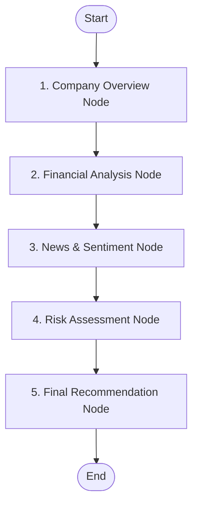

# AI Investment Research Agent

An interactive, high-fidelity investment research web application that allows users to search for any company name or stock ticker and generates a multi-stage AI-powered investment report.

The application leverages a **five-stage LangGraph workflow** on the backend to analyze stock fundamentals, news sentiment, and risk profiles, delivering a structured rating (**INVEST**, **HOLD**, or **PASS**) with an analyst confidence score.

---

## 📂 Project Structure

```text
InvestmentPlanner/
├── package.json          # Root scripts for concurrently running frontend & backend
├── frontend/             # React (Vite) client application
│   ├── src/
│   │   ├── App.jsx       # Main dashboard component & state manager
│   │   ├── App.css       # Layout styles, glows, & mobile responsiveness
│   │   ├── index.css     # Global theme variables & animations
│   │   └── main.jsx      # Entrypoint
│   └── package.json
└── backend/              # Express.js Node server
    ├── server.js         # API Router & Yahoo Finance controller
    ├── package.json      # Dependencies (Express, LangGraph, LangChain)
    ├── .env              # Local environment configs (API keys)
    └── agents/
        └── workflow.js   # Compiled LangGraph sequential pipeline
```

---

## 🛠️ Prerequisites

Ensure you have the following installed on your machine:
- **Node.js**: v18.0.0 or higher (tested on v24.14)
- **npm**: v9.0.0 or higher

---

## 🚀 Setup & Execution Guide

Follow these steps to run the application locally:

### Step 1: Install Dependencies
Run the command below from the **root directory** of the project to automatically install dependencies for the root, frontend, and backend packages:
```bash
npm run install-all
```
*Note: Under the hood, this triggers standard installs inside both subdirectories.*

### Step 2: Configure Environment Variables
1. Navigate to the `backend/` directory.
2. Create or open the `.env` file (`backend/.env`).
3. Add **either** of the following API keys based on your preferred LLM provider:
```env
PORT=5000

# Google Gemini Configuration (Recommended)
GEMINI_API_KEY=your_google_gemini_api_key_here

# OR

# OpenAI Configuration
OPENAI_API_KEY=your_openai_api_key_here
```
*If no keys are configured, the frontend will show a setup instruction banner when you attempt to analyze a company.*

### Step 3: Run the Application
From the **root directory**, start both the Express backend and Vite React dev server concurrently by running:
```bash
npm run dev
```

The terminal will launch the processes:
- **React Frontend**: Ready at [http://localhost:5172/](http://localhost:5172/)
- **Express Backend**: Listening at [http://localhost:5000/](http://localhost:5000/)

---

## 🔬 API Endpoint Documentation

The backend server exposes the following HTTP endpoints:

### 1. Health Status check
- **Method / Path**: `GET /api/status`
- **Description**: Verifies backend readiness.
- **Response**:
  ```json
  {"status":"ok","message":"Backend server is running","timestamp":"..."}
  ```

### 2. Ticker Search Lookup
- **Method / Path**: `GET /api/search?q=<query_string>`
- **Description**: Queries Yahoo Finance for matching equity stock listings.
- **Example**: `GET /api/search?q=Tesla`
- **Response**: Array of matching tickers (symbol, name, sector, exchange).

### 3. Basic Company Profile
- **Method / Path**: `GET /api/company?ticker=<ticker_symbol>`
- **Description**: Fetches real-time price, sector details, and current balance sheet ratios (Current Ratio, Debt-to-Equity, Operating Margin).
- **Example**: `GET /api/company?ticker=AAPL`

### 4. Run AI Agent Research
- **Method / Path**: `POST /api/analyze`
- **Description**: Gathers stock news, passes it to the multi-node LangGraph agent, and returns the compiled report.
- **Body**: `{ "ticker": "AAPL" }`
- **Response**: Returns separate analysis blocks:
  ```json
  {
    "ticker": "AAPL",
    "recommendation": {
      "rating": "INVEST" | "HOLD" | "PASS",
      "confidence": 85,
      "positives": [...],
      "concerns": [...],
      "reasoning": "..."
    },
    "overview": "...",
    "financials": "...",
    "news": "...",
    "risk": "...",
    "timestamp": "..."
  }
  ```

---

## 🤖 The LangGraph Agent Workflow

When you click **Run AI Analysis** in the UI, the backend triggers the sequential workflow defined in `backend/agents/workflow.js`:



1. **Company Overview**: Parses business descriptions and summarizes what the company does.
2. **Financial Analysis**: Assesses balance sheet ratios against standard investment safety benchmarks.
3. **News & Sentiment**: Parses recent headlines and computes media bias.
4. **Risk Assessment**: Highlights primary operational, financial, and competitive threats.
5. **Final Recommendation**: Weighs all prior stages, scores confidence (0-100), and outputs the rating.
